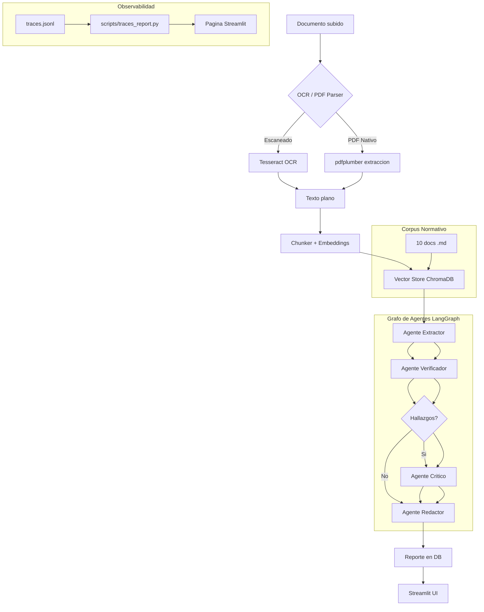

# DocuGuard AI Lite

**Plataforma de verificación de cumplimiento documental** con OCR, RAG y un pipeline multi-agente (LangGraph) que analiza contratos, NDAs y facturas, detecta riesgos y cláusulas problemáticas, y genera reportes de compliance con trazabilidad completa a la fuente original.

## Problema que resuelve

Las organizaciones procesan cientos de documentos legales y financieros donde cláusulas de terminación abusivas, penalizaciones desproporcionadas, montos inconsistentes en facturas y omisiones de jurisdicción pasan desapercibidos en revisiones manuales. Cada error cuesta tiempo, dinero o exposición legal.

DocuGuard AI Lite automatiza la revisión: un pipeline de 4 agentes especializados (extractor, verificador, crítico, redactor) orquestados con LangGraph analiza cada documento contra un corpus normativo de referencia usando RAG, clasifica la severidad de cada hallazgo, y produce un reporte ejecutivo con citas exactas a la fuente. Todo corre en una terminal, sin Docker, sin servidores externos.

## Stack

| Capa | Tecnología |
|------|-----------|
| **Backend** | Python 3.11+, FastAPI, SQLite + SQLAlchemy 2.0 async |
| **Agentes** | LangGraph (StateGraph multi-agente con routing condicional) |
| **RAG** | LlamaIndex + ChromaDB (persistente local, all-MiniLM-L6-v2) |
| **LLM** | Anthropic Claude (SDK oficial). Router preparado para multi-modelo |
| **OCR** | Tesseract (pytesseract) + pdfplumber + PyMuPDF |
| **Frontend** | Streamlit (4 páginas: upload, reportes, eval, observabilidad) |
| **Evaluación** | Ragas + dataset sintético etiquetado (40 docs, 3 formatos c/u) |

## Arquitectura



## Instalacion

### Prerrequisitos

- **Python 3.11 o superior**
- **Tesseract OCR** (para documentos escaneados e imagenes)
- **Ollama** (inferencia local del LLM, gratis, sin API key)

#### Instalar Tesseract

| Sistema | Comando |
|---------|---------|
| **macOS** | `brew install tesseract` |
| **Ubuntu/Debian** | `sudo apt install tesseract-ocr` |
| **Windows** | Descargar de https://github.com/UB-Mannheim/tesseract/wiki y agregar al PATH |

Verificar: `tesseract --version`

#### Instalar Ollama

| Sistema | Instrucciones |
|---------|--------------|
| **macOS / Linux** | `curl -fsSL https://ollama.com/install.sh \| sh` |
| **Windows** | Descargar installer desde https://ollama.com/ e instalar. Luego abrir PowerShell |

```bash
# Descargar el modelo por defecto (llama3.2:3b — ~2GB, rapido)
ollama pull llama3.2:3b

# Alternativa recomendada para mejor precision en extraccion de JSON:
# ollama pull qwen2.5:7b   # ~4.7GB, mas lento pero mas confiable

# Verificar que Ollama esta corriendo:
ollama list
```

> **Nota sobre modelos:** `llama3.2:3b` es el modelo por defecto porque es rapido (3B parametros) y suficiente para clasificacion, pero puede fallar en generar JSON valido consistentemente. Si los agentes devuelven errores de parsing JSON, cambia a `qwen2.5:7b` (7B parametros) editando `OLLAMA_MODEL=qwen2.5:7b` en `.env`. O usa Anthropic (`LLM_PROVIDER=anthropic`) para la corrida final del eval.

### Pasos

```bash
# 1. Clonar
git clone <repo-url> && cd docuguard-ai-lite

# 2. Entorno virtual
python -m venv .venv

# Windows (PowerShell):
.\.venv\Scripts\Activate.ps1

# macOS / Linux:
source .venv/bin/activate

# 3. Dependencias
pip install -r requirements.txt

# 4. Configurar variables de entorno
cp .env.example .env
# Editar .env y completar ANTHROPIC_API_KEY

# 5. Indexar corpus normativo en ChromaDB
python scripts/seed_corpus.py

# 6. Generar dataset sintetico (opcional, ya incluido)
python scripts/generate_synthetic_dataset.py

# 7a. Iniciar backend (Terminal 1)
uvicorn backend.api.main:app --reload --port 8000

# 7b. Iniciar frontend (Terminal 2)
streamlit run app.py
```

### O usar el launcher automatico

```bash
# Windows:
.\run.ps1

# macOS / Linux:
./run.sh
```

## Evaluacion

```bash
# Evaluacion estructural (sin API key, metrics baseline)
python eval/run_eval.py

# Evaluacion completa (requiere ANTHROPIC_API_KEY)
python eval/run_eval.py --full

# Subset
python eval/run_eval.py --subset 5 --full
```

Los reportes se guardan en `eval/results/{timestamp}.md`.

## Uso

1. Abrir http://localhost:8501
2. Subir un documento (PDF, PNG, JPG, TXT)
3. Ir a la pestana Reportes para ver el resultado
4. Cada hallazgo muestra severidad (coloreada), descripcion, cita textual y clausula de referencia
5. Exportar a JSON
6. Ir a Evaluacion para correr el harness contra el dataset
7. Ir a Observabilidad para ver graficos de costo y latencia

## Decisiones de arquitectura

### Por que SQLite y no Postgres?

SQLite satisface las necesidades de un proyecto de portfolio: cero setup, cero servidor, transacciones ACID, un solo archivo. Usamos SQLAlchemy 2.0 con `aiosqlite` para async I/O. En produccion migrariamos a Postgres + pgvector sin cambiar el codigo de la aplicacion — solo cambia la variable `DATABASE_URL` en `.env`.

**Lo que cambiaria en produccion:** conexiones concurrentes reales, pgvector para busqueda vectorial integrada en la DB, replicacion read-replica, connection pooling con Pgbouncer.

### Por que ChromaDB y no pgvector / Pinecone?

ChromaDB corre embebido, sin servidor, con API Python limpia y persistencia a disco. El modelo de embedding (`all-MiniLM-L6-v2`) corre localmente via ONNX. Pinecone requeriria conexion externa y costos recurrentes; pgvector requeriria Postgres. ChromaDB da el mismo concepto (similitud coseno, top-K retrieval, metadata filtering) sin infraestructura.

**Proximo paso:** migrar a pgvector cuando se adopte Postgres, o a Qdrant si se necesita escala horizontal.

### Por que BackgroundTasks y no Celery?

Para ~40 documentos de evaluacion, el procesamiento asincrono con `BackgroundTasks` de FastAPI es suficiente y evita Redis + workers. En produccion con cientos de documentos concurrentes y colas de prioridad, Celery + Redis + Flower seria el reemplazo natural.

**Proximo paso:** Celery con Redis como message broker, workers separados por tipo de agente, y monitoreo con Flower.

### Por que Streamlit y no Next.js?

Streamlit permite UI rica en datos con 100% Python, ideal para herramientas internas, prototipos y demos de portfolio. Next.js daria una experiencia mas pulida para usuarios externos pero requiere Node.js, build step, autenticacion y mas codigo de integracion API.

**Proximo paso:** API Gateway (Kong/nginx) + Next.js frontend + autenticacion OAuth2.

### Por que Ollama y no Claude por defecto?

Usamos Ollama local (`llama3.2:3b`) como proveedor por defecto porque:
1. **Costo cero** — sin API key, sin consumo de tokens, ideal para desarrollo y pruebas
2. **100% offline** — todo corre en la maquina local, sin dependencia de internet
3. **Rapido** — modelos pequenos (3B params) responden en <5s en CPU moderna

El router (`backend/llm/router.py`) lee `LLM_PROVIDER` de `.env`. Para cambiar a Anthropic solo editas esa variable — ningun agente necesita cambios. El cliente Anthropic sigue funcionando y disponible.

**Cuando usar Anthropic:** para la corrida final del eval harness, cuando se necesita maxima calidad de razonamiento y consistencia en JSON. Tambien si `qwen2.5:7b` (la alternativa local recomendada para extraccion) es muy lenta en tu maquina.

**Proximo paso:** routing dinamico multi-modelo: si `confidence_hint > 0.8` y `task_type == "classification"`, usar Ollama (gratis); si no, usar Claude.

### Por que no hay fine-tuning?

Usamos zero-shot con Claude + prompt estructurado con output parsing Pydantic. Para extraccion de campos, esto funciona bien con ~40 documentos. En produccion con miles de documentos de un dominio especifico, un fine-tuning de un modelo pequeno (LayoutLMv3, Donut, o Qwen2.5-VL) daria mayor precision a menor costo por llamada.

**Proximo paso:** fine-tunear un modelo de extracton de campos con LoRA sobre el dataset sintetico.

## Metricas de impacto

*(Pendiente de completar tras la primera corrida del eval completo)*

| Metrica | Structural Baseline | Pipeline Real |
|---------|-------------------|---------------|
| Finding Recall | — | — |
| Finding Precision | — | — |
| Severity Accuracy | — | — |
| Risk Level Accuracy | — | — |
| Extraccion Accuracy | — | — |
| Faithfulness (Ragas) | — | — |
| Costo promedio/doc | — | — |
| Latencia promedio | — | — |

## Checklist para entrevista tecnica

Puntos clave a mencionar sobre este proyecto:

1. **Simplificacion deliberada de infra:** SQLite en vez de Postgres, ChromaDB en vez de pgvector, BackgroundTasks en vez de Celery — cada decision tiene un "que cambiaria en produccion" documentado. Esto muestra criterio de ingenieria.
2. **Multi-agente real con LangGraph:** no es un solo prompt de Claude. Hay 4 agentes especializados con routing condicional (si no hay hallazgos, skip al critico). Cada nodo captura sus errores en `errors[]`.
3. **RAG real con corpus normativo:** no es simulacion. ChromaDB con 10 documentos de referencia, retrieval semantico, contexto inyectado al prompt del Verificador.
4. **Dataset sintetico con ground truth verificable:** 40 documentos, 3 formatos cada uno, 60% con hallazgos, severidad balanceada (<50% high), 12 casos ambiguos marcados.
5. **Evaluacion automatizada:** harness con metricas de recall, precision, severidad accuracy, y preparado para Ragas (faithfulness, context precision/recall).
6. **Observabilidad sin infra externa:** cada llamada LLM se loguea a `traces.jsonl` con timestamp, tokens, costo estimado, latencia. Script de reporte + dashboard en Streamlit.
7. **Router multi-modelo preparado:** el contrato de `route()` esta definido y testeado. Hoy siempre devuelve Anthropic, pero agregar Ollama es cambiar una funcion.

## Estructura del proyecto

```
docuguard-ai-lite/
├── app.py                          # Streamlit: upload page
├── pages/                          # Streamlit pages
│   ├── 1_Reportes.py              # Lista y detalle de reportes
│   ├── 2_Evaluacion.py            # Eval harness UI
│   └── 3_Observabilidad.py        # Graficos de traces.jsonl
├── backend/
│   ├── config.py                   # pydantic-settings
│   ├── api/main.py                 # FastAPI endpoints
│   ├── db/                         # SQLAlchemy async + SQLite
│   ├── ingestion/                  # OCR, PDF parser, chunker
│   ├── rag/                        # ChromaDB + retrieval
│   ├── agents/                     # 4 agentes + LangGraph StateGraph
│   ├── llm/                        # Router + Anthropic + Ollama clients
│   ├── observability/tracing.py    # JSONL tracing
│   └── processing/pipeline.py       # Orquestacion completa
├── eval/                           # Eval harness + metrics
├── scripts/                        # Dataset, seed corpus, traces report
├── data/                           # Corpus normativo, ground truth, synthetic docs
├── chroma_db/                      # Persistencia de ChromaDB (generado)
├── logs/traces.jsonl               # Trazas de LLM (generado)
└── tests/                          # Unit tests
```
