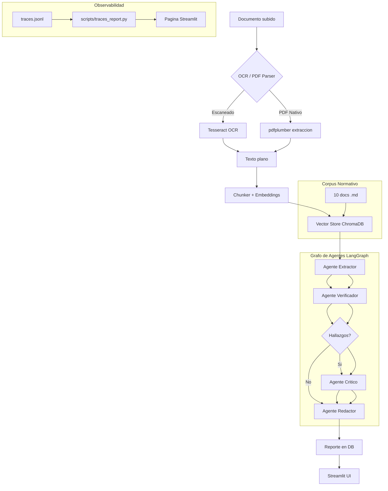

# DocuGuard AI Lite

**Plataforma de verificación de cumplimiento documental** con OCR, RAG y un pipeline multi-agente (LangGraph) que analiza contratos, NDAs y facturas, detecta riesgos y cláusulas problemáticas, y genera reportes de compliance con trazabilidad completa a la fuente original.

## Problema que resuelve

Las organizaciones procesan cientos de documentos legales y financieros donde cláusulas de terminación abusivas, penalizaciones desproporcionadas, montos inconsistentes en facturas y omisiones de jurisdicción pasan desapercibidos en revisiones manuales. Cada error cuesta tiempo, dinero o exposición legal.

DocuGuard AI Lite automatiza la revisión: un pipeline de 4 agentes especializados (extractor, verificador, crítico, redactor) orquestados con LangGraph analiza cada documento contra un corpus normativo de referencia usando RAG, clasifica la severidad de cada hallazgo, y produce un reporte ejecutivo con citas exactas a la fuente. Todo corre en una terminal, sin Docker, sin servidores externos.

## Stack

| Capa | Tecnología |
|------|-----------|
| **Backend** | Python 3.11+, FastAPI, SQLite + SQLAlchemy 2.0 async |
| **Agentes** | LangGraph (StateGraph multi-agente con routing condicional) |
| **RAG** | LlamaIndex + ChromaDB (persistente local, all-MiniLM-L6-v2) |
| **LLM** | Ollama local (`llama3.2:3b`, por defecto, gratis) + Anthropic Claude como alternativa vía `LLM_PROVIDER` |
| **OCR** | Tesseract (pytesseract) + pdfplumber + PyMuPDF |
| **Frontend** | Streamlit (4 páginas: upload, reportes, eval, observabilidad) |
| **Evaluación** | Harness propio (recall, precisión, severidad, risk level, extracción) + dataset sintético etiquetado (40 docs, 3 formatos c/u) |

## Arquitectura



## Instalación

### Prerrequisitos

- **Python 3.11 o superior**
- **Tesseract OCR** (para documentos escaneados e imágenes)
- **Ollama** (inferencia local del LLM, gratis, sin API key — proveedor por defecto)

#### Instalar Tesseract

| Sistema | Comando |
|---------|---------|
| **macOS** | `brew install tesseract` |
| **Ubuntu/Debian** | `sudo apt install tesseract-ocr` |
| **Windows** | Descargar de https://github.com/UB-Mannheim/tesseract/wiki y agregar al PATH |

Verificar: `tesseract --version`

#### Instalar Ollama

| Sistema | Instrucciones |
|---------|--------------|
| **macOS / Linux** | `curl -fsSL https://ollama.com/install.sh \| sh` |
| **Windows** | Descargar installer desde https://ollama.com/ e instalar |

```bash
# Descargar el modelo por defecto (llama3.2:3b — ~2GB)
ollama pull llama3.2:3b

# Verificar que Ollama está corriendo:
curl http://localhost:11434
```

> **Nota sobre modelos:** `llama3.2:3b` es el modelo por defecto porque es rápido y gratis, pero tiene precisión limitada en detección de hallazgos (ver sección de Resultados más abajo). Si necesitás mayor calidad, cambiá `LLM_PROVIDER=anthropic` y completá `ANTHROPIC_API_KEY` en `.env` — ningún agente necesita cambios de código.

### Pasos

```bash
# 1. Clonar
git clone <repo-url> && cd docuguard-ai-lite

# 2. Entorno virtual
python -m venv venv

# Windows (PowerShell):
.\venv\Scripts\Activate.ps1

# macOS / Linux:
source venv/bin/activate

# 3. Dependencias
pip install -r requirements.txt

# 4. Configurar variables de entorno
cp .env.example .env
# Por defecto usa Ollama, no requiere API key.
# Para usar Claude en su lugar, editar LLM_PROVIDER=anthropic y ANTHROPIC_API_KEY en .env

# 5. Indexar corpus normativo en ChromaDB
python scripts/seed_corpus.py

# 6. Generar dataset sintético (opcional, ya incluido en el repo)
python scripts/generate_synthetic_dataset.py

# 7a. Iniciar backend (Terminal 1)
uvicorn backend.api.main:app --reload --port 8000

# 7b. Iniciar frontend (Terminal 2)
streamlit run app.py
```

### O usar el launcher automático

```bash
# Windows:
.\run.ps1

# macOS / Linux:
./run.sh
```

## Evaluación

```bash
# Evaluación estructural (sin llamadas a LLM, valida formato del ground truth)
python eval/run_eval.py

# Evaluación completa (usa Ollama local por defecto, no requiere API key)
python eval/run_eval.py --full

# Subset (útil para pruebas rápidas antes de correr los 40 documentos)
python eval/run_eval.py --full --subset 5

# Para correr la evaluación con Claude en vez de Ollama:
# set LLM_PROVIDER=anthropic y ANTHROPIC_API_KEY en .env antes de correr --full
```

Los reportes se guardan en `eval/results/{timestamp}.md`.

## Resultados del Eval Harness

Evaluación completa sobre el dataset sintético de 40 documentos (contratos, NDAs y facturas), comparando la salida del pipeline multi-agente contra el ground truth etiquetado a mano. Corrida con **Ollama local (`llama3.2:3b`)**.

| Métrica | Valor | Qué mide |
|---|---|---|
| Finding Recall | **0.575** | Qué fracción de los hallazgos esperados el sistema logra detectar |
| Finding Precision | **0.604** | Qué fracción de los hallazgos reportados son reales (vs. falsos positivos) |
| Severity Accuracy | **0.913** | De los hallazgos detectados correctamente, cuántos tienen la severidad (low/medium/high) bien clasificada |
| Risk Level Accuracy | **0.275** | Qué tan seguido el score de riesgo global del documento coincide con el esperado |
| Extraction Accuracy | **0.70** | Qué tan seguido el sistema identifica correctamente el tipo de documento (contrato/NDA/factura) |

### Lectura de los resultados

El patrón es consistente a lo largo de todas las corridas: **el modelo local es notablemente más confiable en tareas de clasificación con contexto acotado que en tareas de detección/generación abierta y de agregación de riesgo global.**

- **Fuerte** en clasificación de severidad (0.913) — cuando el sistema detecta un hallazgo real, casi siempre acierta qué tan grave es.
- **Sólido y balanceado** en detección de hallazgos (Recall 0.575 / Precision 0.604) — tras varias rondas de refinamiento (ver sección de Proceso de Depuración), el sistema pasó de ser "alarmista" (Precision inicial de 0.14, con un 86% de falsos positivos) a un balance razonable entre encontrar problemas reales y no generar ruido excesivo.
- **Débil** en Risk Level Accuracy (0.275) y Extraction Accuracy (0.70) — la clasificación del tipo de documento por parte del Agente Extractor sigue siendo inconsistente entre corridas para casos límite (ej. un NDA clasificado como "contract"), y ese error se propaga al filtro de tipos válidos por documento y al cálculo del riesgo agregado.

Esta asimetría es exactamente el tipo de resultado que un eval harness bien diseñado debería sacar a la luz: no es "el modelo funciona" o "no funciona", es "funciona bien en ciertas etapas del pipeline y mal en otras", lo cual informa directamente dónde invertir el próximo esfuerzo de ingeniería.

### Metodología

- Dataset: 40 documentos sintéticos, distribución 40% limpios / 60% con hallazgos de riesgo, 3 tipos de documento, severidad balanceada (≤50% `high`), y 12 casos ambiguos a propósito (jurisdicción atípica, penalizaciones en el límite de lo razonable).
- Matching de hallazgos por tipo exacto (taxonomía cerrada de 14 categorías, ver `backend/agents/state.py`), no por similitud semántica — más estricto, pero más auditable.
- El eval reutiliza el mismo `backend/llm/router.py` que el resto del sistema, por lo que corre indistintamente contra Ollama o Anthropic vía `LLM_PROVIDER` en `.env`.
- Se confirmó experimentalmente que Ollama, en este entorno, es determinístico con `temperature=0.0`: 3 corridas idénticas del mismo subset produjeron resultados byte-a-byte iguales. Esto permitió diferenciar con confianza entre "ruido del modelo" y "regresión real de código" durante la depuración (ver más abajo).

## Proceso de depuración: de un sistema alarmista a uno balanceado

La primera corrida completa del eval, antes de cualquier ajuste, dio **Finding Precision: 0.14** — el sistema generaba 7 falsos positivos por cada hallazgo real. La causa raíz y el proceso de diagnóstico y corrección se documentan acá porque es, en sí mismo, un ejercicio representativo de depuración de sistemas de IA en producción.

### 1. Procesamiento trabado sin logging

Los documentos quedaban en estado `pending` indefinidamente, sin ningún error visible. Causa: `BackgroundTasks` de FastAPI no propagaba excepciones a la consola. Se migró a `asyncio.create_task` con un callback explícito de logging de excepciones no capturadas.

### 2. Mismatch de identificadores

Los endpoints de consulta devolvían `404 Not Found` para documentos recién subidos. Causa: se comparaba `doc_id` (string) contra la clave primaria numérica de la base con `session.get()`, que busca por PK, no por columna arbitraria. Se corrigió usando `select().where(Document.doc_id == doc_id)`.

### 3. Parseo de JSON en tres variantes de fallo distintas

El parser de respuestas del LLM asumía JSON envuelto en bloques ` ```json `, pero Ollama a veces devuelve el array envuelto en texto libre explicativo, o con errores de formato (números con doble punto decimal, caracteres de control sin escapar). Se resolvió con extracción por regex del array/objeto JSON dentro del texto, más `json_repair` como fallback para JSON malformado.

### 4. Taxonomía de hallazgos inconsistente

El Verificador generaba descripciones libres en español (`"Falta de cláusula de terminación..."`) en vez de códigos fijos (`missing_termination_clause`), impidiendo cualquier comparación automática contra el ground truth. Se centralizó una taxonomía cerrada de 14 categorías en `backend/agents/state.py`, forzada por prompt en el Verificador y preservada literal por el Crítico.

### 5. Sobre-generación de hallazgos (causa raíz de la precisión baja)

Con la taxonomía ya corregida, el sistema seguía generando hallazgos falsos — incluyendo cláusulas "faltantes" que en realidad estaban presentes en el documento. Se implementaron tres capas de validación en código, en cascada, dentro de `verifier_agent.py`:

1. **Validación de cita real**: el `source_snippet` reportado debe aparecer (match exacto o ≥50% de cobertura de palabras) en el texto real del documento. Un hallazgo sin cita, o con cita inventada, se descarta.
2. **Coherencia temática**: para hallazgos de tipo "falta X", se verifica que el tema X no aparezca en ningún lugar del documento completo (si aparece, hay contradicción lógica). Para el resto, se verifica que la cita esté relacionada temáticamente con el tipo de hallazgo reportado.
3. **Validez por tipo de documento**: un diccionario de tipos de hallazgo válidos por categoría de documento (ej. `no_cap_liability` nunca aplica a un NDA) descarta hallazgos fuera de contexto.

Esto llevó la Precisión de 0.14 a 0.60-0.70 en distintas corridas, con el trade-off esperado de una caída moderada en Recall.

### 6. Inconsistencia aritmética no verificable por LLM

La detección de `amount_inconsistency` (montos de factura que no cuadran) dependía de que el modelo "notara" la discrepancia leyendo el texto — poco confiable para aritmética. Se agregó un chequeo determinístico en `extractor_agent.py`: comparación directa `subtotal + iva` vs `monto_total` en código Python, sin pasar por el LLM, inyectado como hallazgo garantizado cuando corresponde.

### 7. Experimento de mejora revertido con evidencia

Se probó agregar un ejemplo few-shot al prompt del Verificador para mejorar la calidad de las citas textuales. Una prueba de control (misma corrida repetida 3 veces, resultados idénticos, confirmando determinismo del modelo) permitió aislar que el cambio causaba una regresión real — el modelo dejaba de generar ciertos hallazgos legítimos en vez de citarlos mejor. Se revirtió el cambio específico, conservando el resto de las mejoras, con una mejora neta confirmada tras el revert.

### Aprendizaje general

Cada síntoma visible (precisión baja, risk level siempre "high", recall inconsistente) tenía una causa de código identificable y corregible — pero varias causas se enmascaraban entre sí, por lo que el orden de diagnóstico importó tanto como las correcciones en sí. La disciplina de: reproducir con logs detallados → aislar la causa con un caso mínimo → corregir → volver a medir con el eval harness, fue lo que permitió pasar de un sistema no confiable a uno con comportamiento entendido y documentado.

## Uso

1. Abrir http://localhost:8501
2. Subir un documento (PDF, PNG, JPG, TXT)
3. Ir a la pestaña Reportes para ver el resultado
4. Cada hallazgo muestra severidad (coloreada), descripción, cita textual y cláusula de referencia
5. Exportar a JSON
6. Ir a Evaluación para correr el harness contra el dataset
7. Ir a Observabilidad para ver gráficos de costo y latencia

## Decisiones de arquitectura

### Por qué SQLite y no Postgres?

SQLite satisface las necesidades de un proyecto de portfolio: cero setup, cero servidor, transacciones ACID, un solo archivo. Usamos SQLAlchemy 2.0 con `aiosqlite` para async I/O. En producción migraríamos a Postgres + pgvector sin cambiar el código de la aplicación — solo cambia la variable `DATABASE_URL` en `.env`.

**Lo que cambiaría en producción:** conexiones concurrentes reales, pgvector para búsqueda vectorial integrada en la DB, replicación read-replica, connection pooling con Pgbouncer, y migraciones formales con Alembic (durante el desarrollo de este proyecto, cambios de esquema requirieron recrear la base manualmente — el primer punto a resolver antes de producción).

### Por qué ChromaDB y no pgvector / Pinecone?

ChromaDB corre embebido, sin servidor, con API Python limpia y persistencia a disco. El modelo de embedding (`all-MiniLM-L6-v2`) corre localmente vía ONNX. Pinecone requeriría conexión externa y costos recurrentes; pgvector requeriría Postgres. ChromaDB da el mismo concepto (similitud coseno, top-K retrieval, metadata filtering) sin infraestructura.

**Próximo paso:** migrar a pgvector cuando se adopte Postgres, o a Qdrant si se necesita escala horizontal.

### Por qué asyncio.create_task y no Celery?

Para ~40 documentos de evaluación, disparar el procesamiento con `asyncio.create_task` dentro del propio proceso de FastAPI es suficiente y evita Redis + workers separados. En producción con cientos de documentos concurrentes y colas de prioridad, Celery + Redis + Flower sería el reemplazo natural — el patrón de logging estructurado y manejo de errores por tarea ya está diseñado para portar a ese modelo sin rehacer lógica.

**Próximo paso:** Celery con Redis como message broker, workers separados por tipo de agente, y monitoreo con Flower.

### Por qué Streamlit y no Next.js?

Streamlit permite UI rica en datos con 100% Python, ideal para herramientas internas, prototipos y demos de portfolio. Next.js daría una experiencia más pulida para usuarios externos pero requiere Node.js, build step, autenticación y más código de integración API. FastAPI se mantiene como capa de API separada y real (no acoplada a Streamlit), lo que permite ese reemplazo de frontend sin tocar la lógica de negocio.

**Próximo paso:** API Gateway (Kong/nginx) + Next.js frontend + autenticación OAuth2.

### Por qué Ollama y no Claude por defecto?

Usamos Ollama local (`llama3.2:3b`) como proveedor por defecto porque:
1. **Costo cero** — sin API key, sin consumo de tokens, ideal para desarrollo y pruebas iterativas.
2. **100% offline** — todo corre en la máquina local, sin dependencia de internet.
3. **Rápido de iterar** — sin preocuparse por costo por request durante debugging.

El router (`backend/llm/router.py`) lee `LLM_PROVIDER` de `.env`. Para cambiar a Anthropic solo se edita esa variable — ningún agente necesita cambios. Los resultados documentados arriba muestran el trade-off real: gratis, pero con calidad de detección y clasificación de tipo de documento notablemente más variable que un modelo de mayor capacidad. Este hallazgo, obtenido con el eval harness y confirmado con pruebas de determinismo, es el argumento de ingeniería para decidir cuándo vale la pena el costo de Claude.

**Próximo paso:** routing dinámico por etapa — usar Ollama para clasificación de severidad (donde ya rinde muy bien, 0.91 de accuracy), y Claude para la etapa de extracción de tipo de documento y detección de hallazgos, donde la variabilidad de Ollama tiene mayor impacto.

### Por qué no hay fine-tuning?

Usamos zero-shot con prompt estructurado y output parsing tolerante a errores de formato (`json_repair`). Para extracción de campos, esto funciona con ~40 documentos. En producción con miles de documentos de un dominio específico, un fine-tuning de un modelo pequeño (LayoutLMv3, Donut, o Qwen2.5-VL) daría mayor precisión a menor costo por llamada.

**Próximo paso:** fine-tunear un modelo de extracción de campos con LoRA sobre el dataset sintético.

## Limitaciones conocidas

- **Extraction Accuracy y Risk Level Accuracy por debajo del resto (0.70 y 0.275).** El Agente Extractor clasifica el tipo de documento de forma inconsistente entre corridas para casos límite, lo cual se propaga al filtro de tipos válidos por documento y al cálculo de riesgo agregado. Es la limitación de mayor impacto identificada y no resuelta — ver "Próximo paso" en la sección de Ollama arriba.
- **Sin migraciones de base de datos (Alembic).** Cambios de esquema durante desarrollo requirieron recrear la base manualmente.
- **Ruido residual de duplicación de hallazgos.** Se identificó y corrigió un bug de duplicación masiva en la acumulación de estado del grafo de LangGraph; puede quedar un remanente marginal no perseguido por rendimientos decrecientes.
- **Procesamiento síncrono por documento, sin cola de tareas.** El sistema no escala horizontalmente en su forma actual — ver "Próximo paso" en la sección de Celery más arriba.


## Estructura del proyecto

```
docuguard-ai-lite/
├── app.py                          # Streamlit: upload page
├── pages/                          # Streamlit pages
│   ├── 1_Reportes.py              # Lista y detalle de reportes
│   ├── 2_Evaluacion.py            # Eval harness UI
│   └── 3_Observabilidad.py        # Graficos de traces.jsonl
├── backend/
│   ├── config.py                   # pydantic-settings
│   ├── api/main.py                 # FastAPI endpoints
│   ├── db/                         # SQLAlchemy async + SQLite
│   ├── ingestion/                  # OCR, PDF parser, chunker
│   ├── rag/                        # ChromaDB + retrieval
│   ├── agents/                     # 4 agentes + LangGraph StateGraph
│   ├── llm/                        # Router + Anthropic + Ollama clients
│   ├── observability/tracing.py    # JSONL tracing
│   └── processing/pipeline.py      # Orquestacion completa
├── eval/                           # Eval harness + metrics
├── scripts/                        # Dataset, seed corpus, traces report
├── data/                           # Corpus normativo, ground truth, synthetic docs
├── chroma_db/                      # Persistencia de ChromaDB (generado)
├── logs/traces.jsonl               # Trazas de LLM (generado)
└── tests/                          # Unit tests
```
