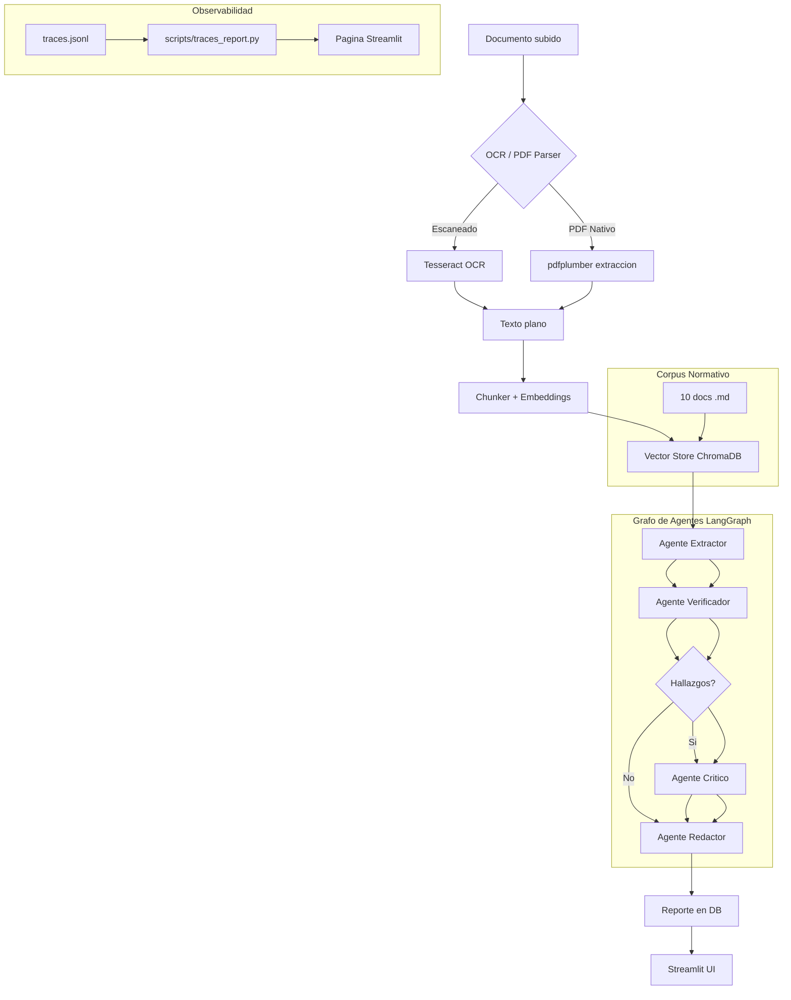

# DocuGuard AI Lite

**Plataforma de verificación de cumplimiento documental** con OCR, RAG y un pipeline multi-agente (LangGraph) que analiza contratos, NDAs y facturas, detecta riesgos y cláusulas problemáticas, y genera reportes de compliance con trazabilidad completa a la fuente original.

## Problema que resuelve

Las organizaciones procesan cientos de documentos legales y financieros donde cláusulas de terminación abusivas, penalizaciones desproporcionadas, montos inconsistentes en facturas y omisiones de jurisdicción pasan desapercibidos en revisiones manuales. Cada error cuesta tiempo, dinero o exposición legal.

DocuGuard AI Lite automatiza la revisión: un pipeline de 4 agentes especializados (extractor, verificador, crítico, redactor) orquestados con LangGraph analiza cada documento contra un corpus normativo de referencia usando RAG, clasifica la severidad de cada hallazgo, y produce un reporte ejecutivo con citas exactas a la fuente. Todo corre en una terminal, sin Docker, sin servidores externos.

## Stack

| Capa | Tecnología |
|------|-----------|
| **Backend** | Python 3.11+, FastAPI, SQLite + SQLAlchemy 2.0 async |
| **Agentes** | LangGraph (StateGraph multi-agente con routing condicional) |
| **RAG** | LlamaIndex + ChromaDB (persistente local, all-MiniLM-L6-v2) |
| **LLM** | Ollama local (`llama3.2:3b`, por defecto, gratis) + Anthropic Claude como alternativa vía `LLM_PROVIDER` |
| **OCR** | Tesseract (pytesseract) + pdfplumber + PyMuPDF |
| **Frontend** | Streamlit (4 páginas: upload, reportes, eval, observabilidad) |
| **Evaluación** | Harness propio (recall, precisión, severidad, risk level, extracción) + dataset sintético etiquetado (40 docs, 3 formatos c/u) |

## Arquitectura



## Instalación

### Prerrequisitos

- **Python 3.11 o superior**
- **Tesseract OCR** (para documentos escaneados e imágenes)
- **Ollama** (inferencia local del LLM, gratis, sin API key — proveedor por defecto)

#### Instalar Tesseract

| Sistema | Comando |
|---------|---------|
| **macOS** | `brew install tesseract` |
| **Ubuntu/Debian** | `sudo apt install tesseract-ocr` |
| **Windows** | Descargar de https://github.com/UB-Mannheim/tesseract/wiki y agregar al PATH |

Verificar: `tesseract --version`

#### Instalar Ollama

| Sistema | Instrucciones |
|---------|--------------|
| **macOS / Linux** | `curl -fsSL https://ollama.com/install.sh \| sh` |
| **Windows** | Descargar installer desde https://ollama.com/ e instalar |

```bash
# Descargar el modelo por defecto (llama3.2:3b — ~2GB)
ollama pull llama3.2:3b

# Verificar que Ollama está corriendo:
curl http://localhost:11434
```

> **Nota sobre modelos:** `llama3.2:3b` es el modelo por defecto porque es rápido y gratis, pero tiene precisión limitada en detección de hallazgos (ver sección de Resultados más abajo). Si necesitás mayor calidad, cambiá `LLM_PROVIDER=anthropic` y completá `ANTHROPIC_API_KEY` en `.env` — ningún agente necesita cambios de código.

### Pasos

```bash
# 1. Clonar
git clone <repo-url> && cd docuguard-ai-lite

# 2. Entorno virtual
python -m venv venv

# Windows (PowerShell):
.\venv\Scripts\Activate.ps1

# macOS / Linux:
source venv/bin/activate

# 3. Dependencias
pip install -r requirements.txt

# 4. Configurar variables de entorno
cp .env.example .env
# Por defecto usa Ollama, no requiere API key.
# Para usar Claude en su lugar, editar LLM_PROVIDER=anthropic y ANTHROPIC_API_KEY en .env

# 5. Indexar corpus normativo en ChromaDB
python scripts/seed_corpus.py

# 6. Generar dataset sintético (opcional, ya incluido en el repo)
python scripts/generate_synthetic_dataset.py

# 7a. Iniciar backend (Terminal 1)
uvicorn backend.api.main:app --reload --port 8000

# 7b. Iniciar frontend (Terminal 2)
streamlit run app.py
```

### O usar el launcher automático

```bash
# Windows:
.\run.ps1

# macOS / Linux:
./run.sh
```

## Evaluación

```bash
# Evaluación estructural (sin llamadas a LLM, valida formato del ground truth)
python eval/run_eval.py

# Evaluación completa (usa Ollama local por defecto, no requiere API key)
python eval/run_eval.py --full

# Subset (útil para pruebas rápidas antes de correr los 40 documentos)
python eval/run_eval.py --full --subset 5

# Para correr la evaluación con Claude en vez de Ollama:
# set LLM_PROVIDER=anthropic y ANTHROPIC_API_KEY en .env antes de correr --full
```

Los reportes se guardan en `eval/results/{timestamp}.md`.

## Resultados del Eval Harness

Evaluación completa sobre el dataset sintético de 40 documentos (contratos, NDAs y facturas), comparando la salida del pipeline multi-agente contra el ground truth etiquetado a mano. Corrida con **Ollama local (`llama3.2:3b`)**.

| Métrica | Valor | Qué mide |
|---|---|---|
| Finding Recall | **0.74** | Qué fracción de los hallazgos esperados el sistema logra detectar |
| Finding Precision | **0.14** | Qué fracción de los hallazgos reportados son reales (vs. falsos positivos) |
| Severity Accuracy | **0.75** | De los hallazgos detectados correctamente, cuántos tienen la severidad (low/medium/high) bien clasificada |
| Risk Level Accuracy | **0.45** | Qué tan seguido el score de riesgo global del documento coincide con el esperado |
| Extraction Accuracy | **0.80** | Qué tan seguido el sistema identifica correctamente el tipo de documento (contrato/NDA/factura) |

### Lectura de los resultados

El patrón es consistente y no es ruido: **el modelo local es notablemente más confiable en tareas de clasificación con contexto acotado que en tareas de detección/generación abierta.**

- **Fuerte** en clasificación de severidad (0.75) y tipo de documento (0.80) — tareas donde el modelo recibe un input ya delimitado y elige entre un set cerrado de opciones.
- **Débil** en precisión de detección (0.14) — el Agente Verificador sobre-genera hallazgos, incluyendo desviaciones en documentos que el ground truth marca como completamente limpios. El recall alto (0.74) confirma que el modelo sí encuentra la mayoría de los problemas reales; el punto débil es que también reporta bastantes que no lo son.

Esta asimetría es exactamente el tipo de resultado que un eval harness bien diseñado debería sacar a la luz: no es "el modelo funciona" o "no funciona", es "funciona bien en ciertas etapas del pipeline y mal en otras", lo cual informa directamente dónde invertir el próximo esfuerzo de ingeniería.

### Metodología

- Dataset: 40 documentos sintéticos, distribución 40% limpios / 60% con hallazgos de riesgo, 3 tipos de documento, severidad balanceada (≤50% `high`), y 12 casos ambiguos a propósito (jurisdicción atípica, penalizaciones en el límite de lo razonable).
- Matching de hallazgos por tipo exacto (taxonomía cerrada de 14 categorías, ver `backend/agents/state.py`), no por similitud semántica — más estricto, pero más auditable.
- El eval reutiliza el mismo `backend/llm/router.py` que el resto del sistema, por lo que corre indistintamente contra Ollama o Anthropic vía `LLM_PROVIDER` en `.env`.

## Uso

1. Abrir http://localhost:8501
2. Subir un documento (PDF, PNG, JPG, TXT)
3. Ir a la pestaña Reportes para ver el resultado
4. Cada hallazgo muestra severidad (coloreada), descripción, cita textual y cláusula de referencia
5. Exportar a JSON
6. Ir a Evaluación para correr el harness contra el dataset
7. Ir a Observabilidad para ver gráficos de costo y latencia

## Decisiones de arquitectura

### Por qué SQLite y no Postgres?

SQLite satisface las necesidades de un proyecto de portfolio: cero setup, cero servidor, transacciones ACID, un solo archivo. Usamos SQLAlchemy 2.0 con `aiosqlite` para async I/O. En producción migraríamos a Postgres + pgvector sin cambiar el código de la aplicación — solo cambia la variable `DATABASE_URL` en `.env`.

**Lo que cambiaría en producción:** conexiones concurrentes reales, pgvector para búsqueda vectorial integrada en la DB, replicación read-replica, connection pooling con Pgbouncer, y migraciones formales con Alembic (durante el desarrollo de este proyecto, cambios de esquema requirieron recrear la base manualmente — el primer punto a resolver antes de producción).

### Por qué ChromaDB y no pgvector / Pinecone?

ChromaDB corre embebido, sin servidor, con API Python limpia y persistencia a disco. El modelo de embedding (`all-MiniLM-L6-v2`) corre localmente vía ONNX. Pinecone requeriría conexión externa y costos recurrentes; pgvector requeriría Postgres. ChromaDB da el mismo concepto (similitud coseno, top-K retrieval, metadata filtering) sin infraestructura.

**Próximo paso:** migrar a pgvector cuando se adopte Postgres, o a Qdrant si se necesita escala horizontal.

### Por qué asyncio.create_task y no Celery?

Para ~40 documentos de evaluación, disparar el procesamiento con `asyncio.create_task` dentro del propio proceso de FastAPI es suficiente y evita Redis + workers separados. En producción con cientos de documentos concurrentes y colas de prioridad, Celery + Redis + Flower sería el reemplazo natural — el patrón de logging estructurado y manejo de errores por tarea ya está diseñado para portar a ese modelo sin rehacer lógica.

**Próximo paso:** Celery con Redis como message broker, workers separados por tipo de agente, y monitoreo con Flower.

### Por qué Streamlit y no Next.js?

Streamlit permite UI rica en datos con 100% Python, ideal para herramientas internas, prototipos y demos de portfolio. Next.js daría una experiencia más pulida para usuarios externos pero requiere Node.js, build step, autenticación y más código de integración API. FastAPI se mantiene como capa de API separada y real (no acoplada a Streamlit), lo que permite ese reemplazo de frontend sin tocar la lógica de negocio.

**Próximo paso:** API Gateway (Kong/nginx) + Next.js frontend + autenticación OAuth2.

### Por qué Ollama y no Claude por defecto?

Usamos Ollama local (`llama3.2:3b`) como proveedor por defecto porque:
1. **Costo cero** — sin API key, sin consumo de tokens, ideal para desarrollo y pruebas iterativas.
2. **100% offline** — todo corre en la máquina local, sin dependencia de internet.
3. **Rápido de iterar** — sin preocuparse por costo por request durante debugging.

El router (`backend/llm/router.py`) lee `LLM_PROVIDER` de `.env`. Para cambiar a Anthropic solo se edita esa variable — ningún agente necesita cambios. Los resultados documentados arriba (Finding Precision 0.14) muestran el trade-off real: gratis, pero con calidad de detección notablemente más baja que un modelo de mayor capacidad. Este hallazgo, obtenido con el eval harness, es el argumento de ingeniería para decidir cuándo vale la pena el costo de Claude.

**Próximo paso:** routing dinámico por etapa — usar Ollama para clasificación de severidad y tipo de documento (donde ya rinde bien, 0.75-0.80 de accuracy), y Claude para la etapa de detección de hallazgos (donde la precisión de Ollama es insuficiente para un caso de uso de compliance real).

### Por qué no hay fine-tuning?

Usamos zero-shot con prompt estructurado y output parsing tolerante a errores de formato (`json_repair`). Para extracción de campos, esto funciona con ~40 documentos. En producción con miles de documentos de un dominio específico, un fine-tuning de un modelo pequeño (LayoutLMv3, Donut, o Qwen2.5-VL) daría mayor precisión a menor costo por llamada.

**Próximo paso:** fine-tunear un modelo de extracción de campos con LoRA sobre el dataset sintético.

## Limitaciones conocidas

- **Precisión de detección baja con el modelo local (0.14).** El Agente Verificador sobre-genera hallazgos con `llama3.2:3b`, incluyendo falsos positivos en documentos limpios. Mitigación documentada arriba (routing por etapa o modelo más grande para esa tarea puntual).
- **Sin migraciones de base de datos (Alembic).** Cambios de esquema durante desarrollo requirieron recrear la base manualmente.
- **Ruido residual de duplicación de hallazgos (~1% del total, 2 casos sobre 150+).** Se identificó y corrigió un bug de duplicación masiva en la acumulación de estado del grafo de LangGraph; queda un remanente marginal no perseguido por rendimientos decrecientes frente al costo de una corrida completa adicional (30-40 min).
- **Procesamiento síncrono por documento, sin cola de tareas.** El sistema no escala horizontalmente en su forma actual — ver "Próximo paso" en la sección de Celery más arriba.

## Checklist para entrevista técnica

Puntos clave a mencionar sobre este proyecto:

1. **Simplificación deliberada de infra:** SQLite en vez de Postgres, ChromaDB en vez de pgvector, `asyncio.create_task` en vez de Celery — cada decisión tiene un "qué cambiaría en producción" documentado. Esto muestra criterio de ingeniería, no atajos sin pensar.
2. **Multi-agente real con LangGraph:** no es un solo prompt. 4 agentes especializados con routing condicional (si no hay hallazgos, se salta el Crítico). Cada nodo captura sus errores en `errors[]`.
3. **RAG real con corpus normativo:** ChromaDB con 10 documentos de referencia, retrieval semántico, contexto inyectado al prompt del Verificador — no es una simulación.
4. **Dataset sintético con ground truth verificable:** 40 documentos, 3 formatos cada uno, 60% con hallazgos, severidad balanceada (≤50% high), 12 casos ambiguos marcados a propósito.
5. **Evaluación automatizada con resultados reales, no maquillados:** el eval reveló una asimetría real de calidad (fuerte en clasificación, débil en detección) — la historia de cómo se llegó a esos números (varios bugs de infraestructura encontrados y corregidos en el camino: procesamiento trabado, mismatch de IDs, taxonomía de hallazgos, parseo de JSON en 3 variantes distintas) es en sí misma un buen relato de debugging sistemático.
6. **Observabilidad sin infra externa:** cada llamada LLM se loguea a `traces.jsonl` con timestamp, tokens, costo estimado, latencia.
7. **Router multi-modelo funcional, no solo preparado:** el contrato de `route()` está implementado y probado con dos proveedores reales (Ollama y Anthropic), intercambiables por variable de entorno sin tocar código de agentes.

## Estructura del proyecto

```
docuguard-ai-lite/
├── app.py                          # Streamlit: upload page
├── pages/                          # Streamlit pages
│   ├── 1_Reportes.py              # Lista y detalle de reportes
│   ├── 2_Evaluacion.py            # Eval harness UI
│   └── 3_Observabilidad.py        # Graficos de traces.jsonl
├── backend/
│   ├── config.py                   # pydantic-settings
│   ├── api/main.py                 # FastAPI endpoints
│   ├── db/                         # SQLAlchemy async + SQLite
│   ├── ingestion/                  # OCR, PDF parser, chunker
│   ├── rag/                        # ChromaDB + retrieval
│   ├── agents/                     # 4 agentes + LangGraph StateGraph
│   ├── llm/                        # Router + Anthropic + Ollama clients
│   ├── observability/tracing.py    # JSONL tracing
│   └── processing/pipeline.py      # Orquestacion completa
├── eval/                           # Eval harness + metrics
├── scripts/                        # Dataset, seed corpus, traces report
├── data/                           # Corpus normativo, ground truth, synthetic docs
├── chroma_db/                      # Persistencia de ChromaDB (generado)
├── logs/traces.jsonl               # Trazas de LLM (generado)
└── tests/                          # Unit tests
```
